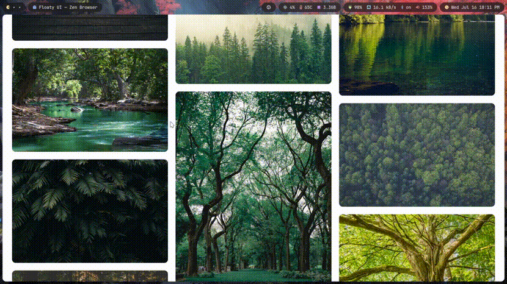
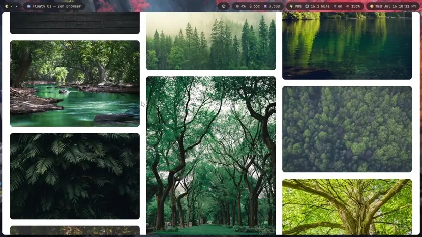

# GitHub Image Test

Tests which image formats are supported in GitHub README Markdown.

> [!NOTE]
> Doesn't apply for GitHub Rich Text Editor.

## Animated Image

| Constraint | Value                                                     |
| :--------- | :-------------------------------------------------------- |
| Width      | [830 px](./docs/width.md)                                 |
| FPS        | [20 FPS](https://github.com/ImageOptim/gifski/issues/351) |

| Format | Command                                                                                           | Size |
| :----- | :------------------------------------------------------------------------------------------------ | ---: |
| GIF    | `ffmpeg -i test.mp4 -vf scale=830:-2,fps=20 -loop 0 -c:v gif test.gif`                            | 14MB |
| WebP   | `ffmpeg -i test.mp4 -vf scale=830:-2,fps=20 -loop 0 -c:v libwebp_anim test.webp`                  |  6MB |
| AVIF   | `ffmpeg -i test.mp4 -vf scale=830:-2,fps=20 -loop 0 -c:v libsvtav1 test.avif`                     |  2MB |
| OPAVIF | `ffmpeg -i test.mp4 -vf scale=830:-2,fps=30 -loop 0 -c:v libsvtav1 -preset 6 -crf 23 testop.avif` |  5MB |

### MP4 — Source

### GIF

### WebP

### AVIF

### OPAVIF

